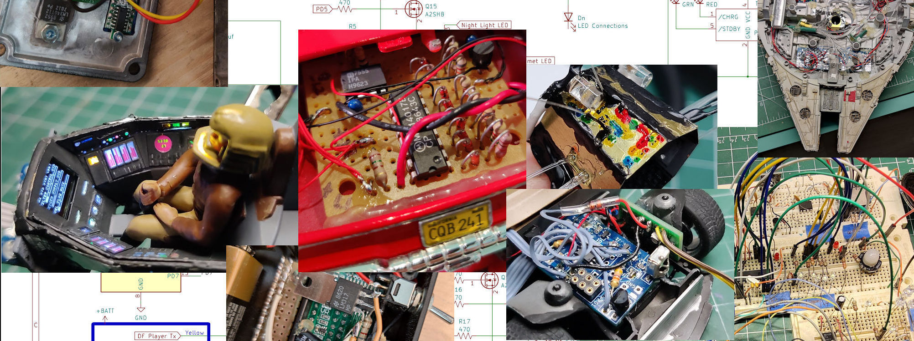

Hello and welcome, I enjoy building things and love putting electronics into hobby models and other projects. Take a look at some of my projects and if you would like to also add some electronics to your own models look at the various development boards I have available.

> [!NOTE]
> [See My YouTube Channel for the videos on these models as well as the available development boards and assembly examples](https://www.youtube.com/@Johnny_Electronic)

## Model Projects

 __BSG Colonial Viper Mark-I__

- [BSG Viper Video](https://www.youtube.com/watch?v=9N_tKHS_4eY)
- [BSG Viper Source Files](https://github.com/JohnnyElectronic/BSG_Colonial_Viper_Mk1)

 __Millenium Falcon__

- [Millenium Falcon Video](https://www.youtube.com/watch?v=YH-89VmUFoE)
- [Millenium Falcon Source Files](https://github.com/JohnnyElectronic/Millennium_Falcon_TLJ)

 __BMW Z3__

- [BMW Z3 Video](https://www.youtube.com/watch?v=tOjA5AFMMV8)
- [BMW Z3 Source Files](https://github.com/JohnnyElectronic/BMW_Z3)

## Development Boards

- [Programming Cables](https://github.com/JohnnyElectronic/Dev_Boards/tree/main/Cables)
- [Devlopment Boards](https://github.com/JohnnyElectronic/Dev_Boards/)
- [TP4057 Lipo Charger Board](https://github.com/JohnnyElectronic/Dev_Boards/tree/main/TP4057_Lipo_Charger)

